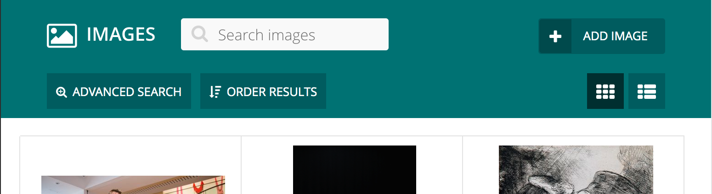
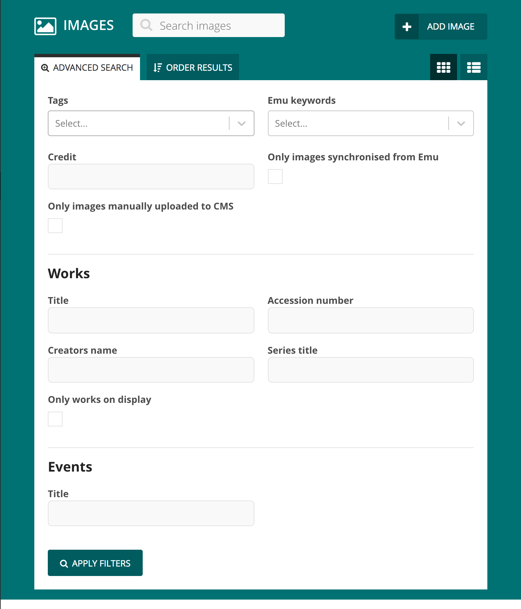
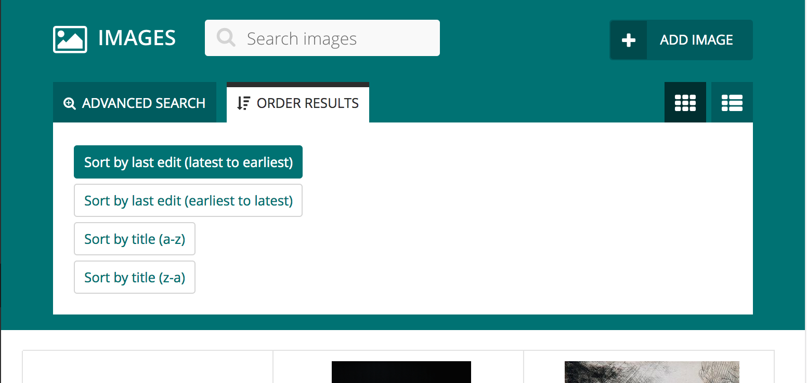

# wagtail-admin-list-controls

Adds advanced search, ordering and layout controls to wagtail's modeladmin list views.




- [Installation](#installation)
- [Basic usage](#basic-usage)
- [Screenshots](#screenshots)
- [Rationale and goals](#rationale-and-goals)
- [Test suite](#test-suite)
- [Building the project](#building-the-project)


## Installation

Note that this project will be published to PyPI sometime soon, we're currently evaluating some changes to improve usability.

If you'd like to use it right now, your best best would be to clone the repo.


## Basic usage

The code below will wire up an extended list view for `MyModel` instances. The view will add a string filter and
sorting option.

```python
# wagtail_hooks.py

from wagtail.contrib.modeladmin.options import ModelAdmin, modeladmin_register
from wagtail.contrib.modeladmin import views as modeladmin_views
from admin_list_controls.views import AdminListControlsMixin
from admin_list_controls.options import ListViewOptions, FilterOptions, SortOptions, Filter, Sort, \ 
    STRING_FILTER, SORT_PARAM
from .models import MyModel

FOO_FILTER_NAME = 'foo'
BAR_SORT_VALUE = 'bar_sort'


class MyModelAdminIndexView(AdminListControlsMixin, modeladmin_views.IndexView):
    def build_list_control_options(self):
        foo_filter_value = self.request.get(FOO_FILTER_NAME)
        selected_sort = self.request.get(SORT_PARAM)

        return ListViewOptions(
            filters=FilterOptions([
                Filter(
                    name=FOO_FILTER_NAME,
                    label="Foo filter",
                    results_description='matching foo <strong>%s</strong>' % foo_filter_value,
                    type=STRING_FILTER,
                    value=foo_filter_value,
                ),
            ]),
            sorts=SortOptions([
                Sort(
                    label='Bar sort',
                    results_description='Sorted by Bar sort',
                    value=BAR_SORT_VALUE,
                    is_selected=selected_sort == BAR_SORT_VALUE,
                    is_default=True,
                ),
            ]),
        )
    
    def apply_list_controls_to_queryset(self, queryset):
        for filter_obj in self.get_selected_list_control_filters():
            filter_name = filter_obj['name']
            filter_value = filter_obj['value']
            if filter_name == FOO_FILTER_NAME:
                queryset = queryset.filter(foo_field__icontains=filter_value)

        selected_sorts = self.get_selected_list_control_sorts()
        selected_sort_value = selected_sorts[0]['value'] if selected_sorts else None 
        if selected_sort_value == BAR_SORT_VALUE:
            queryset = queryset.order_by('bar_field')

        return queryset


@modeladmin_register
class TestModelAdmin(ModelAdmin):
    model = MyModel
    index_view_class = MyModelAdminIndexView
```


## Screenshots

### Collapsible "Advanced Search" and "Order Results" panels with buttons to change layouts. 


### "Advanced Search" panel expanded and displaying a powerful search interface. 




### "Order Results" panel expanded and displaying multiple options to control ordering of the results. 




### A textual description of the search & ordering controls is provided to improve UX.


## Rationale and goals

This library emerged from a large build that required an admin list-view with an exhaustive set of filters and the 
ability for users to change the ordering of the results. The filters would need to perform exact and substring matching 
against textual fields, as well as exact matches on boolean and choice fields. 

We initially attempted to use Wagtail's built-in searching and filtering features, but they were found to be too 
simple for our use-cases and resulted in a clunky user-experience. Third-party libraries were investigated, but little 
were found that came close to matching our requirements.

Somewhat reluctantly, this library was built to cover our needs. Now that the dust has settled and the code has 
stabilised, we're finding increasing numbers of use-cases for it.


## Test suite

```
# Setup
npm install
npm run build
pip install -r requirements.txt
./manage.py migrate
```

```
# Run the tests
./manage.py test admin_list_controls
```


## Building the project

### Build for development

```
# Frontend
npm install
npm run build-dev
```

```
# Backend
pip install -r requirements.txt
./manage.py migrate
./manage.py runserver
```


### Build for release

```
npm install
npm run build
python setup.py sdist bdist_wheel
python setup.py upload
``` 
