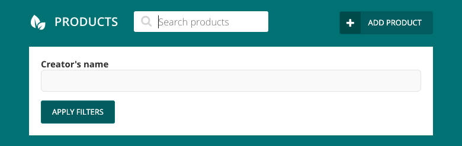

# wagtail-admin-list-controls

A UI toolkit that extends Wagtail's admin list views and allows you to build custom filters, buttons, panels and more.


- [Installation](#installation)
- [Basic usage](#basic-usage)
- [Documentation](#documentation)
    - [Views](#views)
    - [Components](#components)
    - [Filters](#filters)
    - [Selectors](#selectors)
    - [Actions](#actions)
- [Rationale and goals](#rationale-and-goals)
- [Project setup](#project-setup)


## Installation

```
pip install wagtail-admin-list-controls
```

and add `'admin_list_controls'` to `INSTALLED_APPS` in your settings.


## Basic usage

The following example provides two text inputs that allow the user to perform different queries against
the `name` fields on two different models. 

```python
from wagtail.contrib.modeladmin.options import ModelAdmin, modeladmin_register
from admin_list_controls.views import ListControlsIndexView
from admin_list_controls.components import Button, Panel, Columns
from admin_list_controls.actions import SubmitForm
from admin_list_controls.filters import TextFilter


class IndexView(ListControlsIndexView):
        def build_list_controls(self):
            return [
                Panel()(
                    Columns()(
                        TextFilter(
                            name="product_name",
                            label="Product name",
                            apply_to_queryset=lambda queryset, value: queryset.filter(name__icontains=value)
                        ),
                        TextFilter(
                            name="creators_name",
                            label="Creator's name",
                            apply_to_queryset=lambda queryset, value: queryset.filter(created_by__name__icontains=value)
                        ),
                    ),
                    Button(action=SubmitForm())(
                        "Apply filters",
                    ),
                ),
            ]


@modeladmin_register
class MyModelAdmin(ModelAdmin):
    index_view_class = IndexView
    # ...
```

The code above should give you a UI that looks like




## Documentation


### Views

To use this lib, you'll want to override the index view on your `ModelAdmin` instance. To do this,
it's recommended to subclass `admin_list_controls.views.ListControlsIndexView`. If you already have
a custom index view defined, you can use `admin_list_controls.views.ListControlsIndexViewMixin`.

To define the controls used for the UI, define the `build_list_controls` method on your index view and 
return them in a list.

If you want to effect the queryset based on multiple controls, you can use the `apply_list_controls_to_queryset`
method.


### Components

Components are the basic building blocks of the UI. They are invoked with options, and a second call is used 
to define their children. For example:

```python
# Render multiple components nested within other components
from admin_list_controls.components import Block, Icon, Text, Button

Block(style={'color': 'blue'})(
    'This is some blue text before a button',
    Button()(
        Icon('icon icon-plus'), 
        'Click me!',    
    ),
    Text('This is some pink text after a button', style={'color': 'pink'}),
)
```

All components share two basic options:
 - `extra_classes`: a string of classnames to add to the component. For example, `'some_class and_another_class'`.
 - `style`: a dictionary of inline styles that are applied to the component. For example, `{'color': 'red'}`.  

#### Block

Blocks are analogous to HTML divs. They are block elements that are mostly useful for tweaking the UI in small ways.

```python
# Render a block element with a custom classname that uses floats to move content right.
from admin_list_controls.components import Block

Block(extra_classes='custom_class', style={'float': 'right'})(
    # Child components ...
)
```


#### Spacer

Spacers are a pre-configured Block component that provides some vertical space. Useful for moving text and buttons further
down the UI.

```python
# Render a block element that uses HTML float styling.
from admin_list_controls.components import Spacer

Spacer()(
    # Child components ...
)
```


#### Columns

Column components divide their child components into two equally-spaced columns. You can use the `column_count`
argument to define how many columns are used. 

```python
# Render a block element that uses HTML float styling.
from admin_list_controls.components import Columns

# Two columns of components
Columns()(
    # Child components ...
)

# Three columns of components
Columns(column_count=3)(
    # Child components ...
)
```

#### Divider

Divider are analogous to a HTML hr element. They are used to draw horizontal lines that distinguish between areas
of the UI.

```python
from admin_list_controls.components import Divider

Divider()
```


#### Panel

Panels are container components that provide a white background and are best used to house filters or other components
that involve a textual component.

They can be collapsed or expanded by default, by defining the `collapsed` argument.

You can dynamically control the collapsed/expanded state of a panel by using the   

```python
from admin_list_controls.components import Panel

# An expanded panel
Panel()(
    # Child components ...
)

# A panel collapsed by default, with the ref `my_panel`
Panel(collapsed=True, ref='foo')(
    # Child components ...
)

# A button that will toggle the collapsed/expanded state of the `foo` Panel
from admin_list_controls.components import Button
from admin_list_controls.actions import TogglePanel
Button(action=TogglePanel(ref='foo'))(
    'Click me to open and close the `foo` panel'
)
```

#### Icon

Icon components are used to insert icons, usually from wagtail's built-in icons are from a library such as 
`wagtailfontawesome`. They are invoked with a classname argument. 

```python
from admin_list_controls.components import Icon

Icon('icon icon-plus')
```

#### Text

Text components are used to wrap inline text. You can invoke a `Text` component to define options on it, or
you can define it as a string within another component.

Text can have a `size` argument defined, it defaults to `Text.MEDIUM`. There is also a `Text.LARGE` constant
to display text in a size fit for a heading. 

```python
from admin_list_controls.components import Block, Text

Text('Some text that will display')
Text('Some large heading text', size=Text.LARGE)

# Text components can also be defined by using a normal string as a child of another component
Block()('Some more text will display')
```

#### Button

Button components are used for adding dynamic behavior to your UI, such as selecting values, submitting forms,
expanding panels, following links, etc.

Buttons accept an `action` argument, which can be an [Action](#actions) instance or a list of Actions.

```python
from admin_list_controls.components import Button
from admin_list_controls.actions import SetValue, SubmitForm, Link

Button()('Some basic button with text')

Button(action=[
    SetValue(name='name_of_param', value='value_of_param'),
    SubmitForm(),
])(
    'This button sets a value and then submits the search form'
)

Button(action=Link('https://google.com'))(
    'This button will send the user to Google'
)
```

#### Summary

Summary components are used to summarise the data selected in different filters and selectors.
It renders multiple buttons that can be used to reset specific values or the entire set of form 
data. 

```python
from admin_list_controls.components import Summary

Summary()
```


### Filters


### Selectors


### Actions


## Rationale and goals

This library emerged from a large build that required an admin list view with an exhaustive set of filters and the 
ability for users to change the ordering of the results. The filters would need to perform exact and substring matching 
against textual fields, as well as exact matches on boolean and choice fields. Some of the sorts applied to order the 
results also relied on complicated querying and conditional behaviours. In some extreme conditions, certain 
combinations of filters and sorts would require distinct code paths.

We initially attempted to use Wagtail's built-in searching and filtering features, but they were found to be too 
limiting for our use-cases and resulted in a non-optimal experience for users. Third-party libraries were 
investigated, but the ecosystem doesn't have much covering the space.

Somewhat reluctantly, this library was built to cover our needs. Now that the dust has settled and the code has 
stabilised, we're finding increasing numbers of use-cases for it.


## Project setup

```
# Frontend
npm install
npm run build
```

```
# Backend
virtualenv venv
source venv/bin/activate
pip install -r requirements.txt
./test_project/manage.py migrate
```


## Test suite

```
./test_project/manage.py test admin_list_controls
```


## Building the project

### Building the frontend

```
# Development (file watchers, no optimisation, etc)
npm run build-dev

# Production/release
npm run build
```

### Building the project for release

```
npm run build
rm -rf dist/
python setup.py sdist bdist_wheel
python setup.py upload
```
